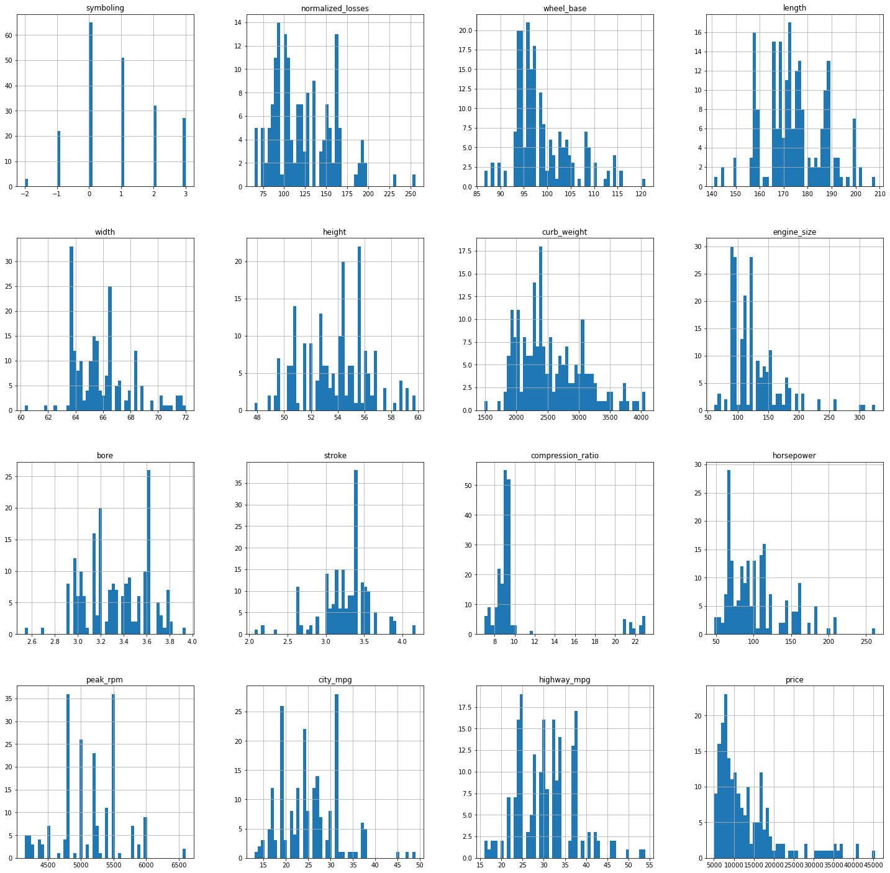

# Analysing the 'Automobile Data Set' from the UC Irvine Machine Learning repository

This notebook is used to analyze the 'Automobile Data Set' from the UC Irvine Machine Learning repository. The dataset is available [here](https://archive.ics.uci.edu/ml/datasets/Automobile). **The objective is to create a model to predict car prices base on its attributes**.

This data set consists of three types of entities: (a) the specification of an auto in terms of various characteristics, (b) its assigned insurance risk rating, (c) its normalized losses in use as compared to other cars. Sources:

1) 1985 Model Import Car and Truck Specifications, 1985 Ward's Automotive Yearbook.
2) Personal Auto Manuals, Insurance Services Office, 160 Water Street, New York, NY 10038
3) Insurance Collision Report, Insurance Institute for Highway Safety, Watergate 600, Washington, DC 20037

The notebook is divided as follows:
    
1. Data exploration
2. Train ML model
3. Evaluate the ML model
4. Conclusion

----------

## 1. Data exploration

In this section, we explore the characteristics of the dataset, including its dimensions and characteristics of its variables.

The dataset contains only two columns and 36 lines. The attributes for each column are upload from the website.

After importing the data, we need to do some data cleaning. For now, we just substitute the "?" values by NaN, and make a few adjustements to the categorical variables, which will not significantly impact our model, but are necessary for it to function. We will remove the auto maker 'Mercury' because it appear only once in the whole data set, and this compromise the model we will develop. We also transform some numerical columns that were objects to float. Finally, we drop all the rows without a price for the car, as they do not help us train our model.


```python
import pandas as pd
import numpy as np
```

----------

### Getting the data


```python
attributes = ['symboling','normalized_losses','make','fuel_type','aspiration','num_of_doors','body_style',
           'drive_wheels','engine_location','wheel_base','length','width','height','curb_weight','engine_type',
           'num_of_cylinders','engine_size','fuel_system','bore','stroke','compression_ratio','horsepower',
           'peak_rpm','city_mpg','highway_mpg','price']
df_data = pd.read_csv('/Users/leuzinger/Dropbox/Data Science/Awari/Regressions/Automobile Data Set/imports-85(1).data',names=attributes)
df_data.reset_index(inplace=False)
pd.set_option('display.max_columns', None)
pd.set_option('display.max_rows', None)
df_data.head()
```


<div>
<style scoped>
    .dataframe tbody tr th:only-of-type {
        vertical-align: middle;
    }

    .dataframe tbody tr th {
        vertical-align: top;
    }

    .dataframe thead th {
        text-align: right;
    }
</style>
<table border="1" class="dataframe">
  <thead>
    <tr style="text-align: right;">
      <th></th>
      <th>symboling</th>
      <th>normalized_losses</th>
      <th>make</th>
      <th>fuel_type</th>
      <th>aspiration</th>
      <th>num_of_doors</th>
      <th>body_style</th>
      <th>drive_wheels</th>
      <th>engine_location</th>
      <th>wheel_base</th>
      <th>length</th>
      <th>width</th>
      <th>height</th>
      <th>curb_weight</th>
      <th>engine_type</th>
      <th>num_of_cylinders</th>
      <th>engine_size</th>
      <th>fuel_system</th>
      <th>bore</th>
      <th>stroke</th>
      <th>compression_ratio</th>
      <th>horsepower</th>
      <th>peak_rpm</th>
      <th>city_mpg</th>
      <th>highway_mpg</th>
      <th>price</th>
    </tr>
  </thead>
  <tbody>
    <tr>
      <th>0</th>
      <td>3</td>
      <td>?</td>
      <td>alfa-romero</td>
      <td>gas</td>
      <td>std</td>
      <td>two</td>
      <td>convertible</td>
      <td>rwd</td>
      <td>front</td>
      <td>88.6</td>
      <td>168.8</td>
      <td>64.1</td>
      <td>48.8</td>
      <td>2548</td>
      <td>dohc</td>
      <td>four</td>
      <td>130</td>
      <td>mpfi</td>
      <td>3.47</td>
      <td>2.68</td>
      <td>9.0</td>
      <td>111</td>
      <td>5000</td>
      <td>21</td>
      <td>27</td>
      <td>13495</td>
    </tr>
    <tr>
      <th>1</th>
      <td>3</td>
      <td>?</td>
      <td>alfa-romero</td>
      <td>gas</td>
      <td>std</td>
      <td>two</td>
      <td>convertible</td>
      <td>rwd</td>
      <td>front</td>
      <td>88.6</td>
      <td>168.8</td>
      <td>64.1</td>
      <td>48.8</td>
      <td>2548</td>
      <td>dohc</td>
      <td>four</td>
      <td>130</td>
      <td>mpfi</td>
      <td>3.47</td>
      <td>2.68</td>
      <td>9.0</td>
      <td>111</td>
      <td>5000</td>
      <td>21</td>
      <td>27</td>
      <td>16500</td>
    </tr>
    <tr>
      <th>2</th>
      <td>1</td>
      <td>?</td>
      <td>alfa-romero</td>
      <td>gas</td>
      <td>std</td>
      <td>two</td>
      <td>hatchback</td>
      <td>rwd</td>
      <td>front</td>
      <td>94.5</td>
      <td>171.2</td>
      <td>65.5</td>
      <td>52.4</td>
      <td>2823</td>
      <td>ohcv</td>
      <td>six</td>
      <td>152</td>
      <td>mpfi</td>
      <td>2.68</td>
      <td>3.47</td>
      <td>9.0</td>
      <td>154</td>
      <td>5000</td>
      <td>19</td>
      <td>26</td>
      <td>16500</td>
    </tr>
    <tr>
      <th>3</th>
      <td>2</td>
      <td>164</td>
      <td>audi</td>
      <td>gas</td>
      <td>std</td>
      <td>four</td>
      <td>sedan</td>
      <td>fwd</td>
      <td>front</td>
      <td>99.8</td>
      <td>176.6</td>
      <td>66.2</td>
      <td>54.3</td>
      <td>2337</td>
      <td>ohc</td>
      <td>four</td>
      <td>109</td>
      <td>mpfi</td>
      <td>3.19</td>
      <td>3.40</td>
      <td>10.0</td>
      <td>102</td>
      <td>5500</td>
      <td>24</td>
      <td>30</td>
      <td>13950</td>
    </tr>
    <tr>
      <th>4</th>
      <td>2</td>
      <td>164</td>
      <td>audi</td>
      <td>gas</td>
      <td>std</td>
      <td>four</td>
      <td>sedan</td>
      <td>4wd</td>
      <td>front</td>
      <td>99.4</td>
      <td>176.6</td>
      <td>66.4</td>
      <td>54.3</td>
      <td>2824</td>
      <td>ohc</td>
      <td>five</td>
      <td>136</td>
      <td>mpfi</td>
      <td>3.19</td>
      <td>3.40</td>
      <td>8.0</td>
      <td>115</td>
      <td>5500</td>
      <td>18</td>
      <td>22</td>
      <td>17450</td>
    </tr>
  </tbody>
</table>
</div>


```python
df_data['num_of_doors'].replace("?","four",inplace=True)
df_data.replace("?",np.nan,inplace=True)
df_data.dropna(subset = ["price"], inplace=True)
indexNames = df_data[df_data['make'] == 'mercury'].index
df_data.drop(indexNames, inplace=True)

num_cols = ['symboling', 'normalized_losses', 'wheel_base', 'length', 'width',
       'height', 'curb_weight', 'engine_size', 'bore', 'stroke',
       'compression_ratio', 'horsepower', 'peak_rpm', 'city_mpg',
       'highway_mpg', 'price']
df_data[num_cols] = df_data[num_cols].apply(pd.to_numeric, errors='coerce')

df_data.reset_index(drop=True,inplace=True)
```


```python
df_data.info()
```

    <class 'pandas.core.frame.DataFrame'>
    RangeIndex: 200 entries, 0 to 199
    Data columns (total 26 columns):
     #   Column             Non-Null Count  Dtype  
    ---  ------             --------------  -----  
     0   symboling          200 non-null    int64  
     1   normalized_losses  164 non-null    float64
     2   make               200 non-null    object 
     3   fuel_type          200 non-null    object 
     4   aspiration         200 non-null    object 
     5   num_of_doors       200 non-null    object 
     6   body_style         200 non-null    object 
     7   drive_wheels       200 non-null    object 
     8   engine_location    200 non-null    object 
     9   wheel_base         200 non-null    float64
     10  length             200 non-null    float64
     11  width              200 non-null    float64
     12  height             200 non-null    float64
     13  curb_weight        200 non-null    int64  
     14  engine_type        200 non-null    object 
     15  num_of_cylinders   200 non-null    object 
     16  engine_size        200 non-null    int64  
     17  fuel_system        200 non-null    object 
     18  bore               196 non-null    float64
     19  stroke             196 non-null    float64
     20  compression_ratio  200 non-null    float64
     21  horsepower         198 non-null    float64
     22  peak_rpm           198 non-null    float64
     23  city_mpg           200 non-null    int64  
     24  highway_mpg        200 non-null    int64  
     25  price              200 non-null    int64  
    dtypes: float64(10), int64(6), object(10)
    memory usage: 40.8+ KB


----------

### Data visualization

A "quick way to get a feel of the type of data you are dealing with is to plot a histogram for each numerical attribute" (GÉRON, 2019).

**For this initial exploration, we are only considering continous values. Categorical values will be examined later**.

Therefore, we will start our analysis making some histograms that are useful for understanding the dataset. We see that some histograms are tail-heavy: they extend much farther to the right of the median than to the left. Besides, only few attributes seems to have a normal distribution.

Next, we can look to which attributes have the higher correlation with the price. First, we create a correlation matrix. Then, we make some scatter plots and a heatmap to vizualaize the correlations. **We can see that the varibales that have the stronger postive correlations with the car price are the engine size, curb weight, horsepower, and with. Besides, city mpg and highway mpg have a strong negative correlation with the price**.


```python
import matplotlib.pyplot as plt

df_data.hist(bins=50,figsize=(25, 25))

plt.show()
```


    

    


```python
corr_matrix = df_data.corr()
corr_matrix['price'].sort_values(ascending=False)
```


    price                1.000000
    engine_size          0.872273
    curb_weight          0.834331
    horsepower           0.814471
    width                0.751403
    length               0.690418
    wheel_base           0.584161
    bore                 0.544032
    normalized_losses    0.203254
    height               0.134725
    stroke               0.083287
    compression_ratio    0.072318
    symboling           -0.082695
    peak_rpm            -0.101200
    city_mpg            -0.686460
    highway_mpg         -0.704658
    Name: price, dtype: float64


```python
import seaborn as sns

plt.figure(figsize=(20, 30))
sns.set_theme()
sns.set_context("notebook", font_scale=1.5)
sns.heatmap(corr_matrix,annot=True)
plt.show()
```


    

    


----------

### Creating the Train and Test sets

Creating a test set at the beginning of the project avoid *data snooping* bias, i.e., "when you estimate the generalization error using the test set, your estimate will be too optimistic, and you will launch a system that will not perform as well as expected" (GÉRON, 2019). To avoid this problem, we divide our data into a train and a test set. 

Besides, to avoid introducing a sampling bias into the sets, we will use a stratified sampling, taking the car brand as the reference because it is the categorical variable with more unique values. By doing this, the test set generated using stratified sampling has symboling category proportions almost identical to those in the full dataset.


```python
df_data.drop(columns=num_cols).nunique()
```


    make                21
    fuel_type            2
    aspiration           2
    num_of_doors         2
    body_style           5
    drive_wheels         3
    engine_location      2
    engine_type          6
    num_of_cylinders     7
    fuel_system          8
    dtype: int64


```python
from sklearn.model_selection import StratifiedShuffleSplit

split = StratifiedShuffleSplit(n_splits=1, test_size=0.2)

for train_index, test_index in split.split(df_data,df_data['make']):
    train_set = df_data.loc[train_index]
    test_set = df_data.loc[test_index]
```


```python
test_set['make'].value_counts()/len(test_set)
```


    toyota           0.150
    nissan           0.100
    mitsubishi       0.075
    mazda            0.075
    honda            0.075
    dodge            0.050
    peugot           0.050
    mercedes-benz    0.050
    bmw              0.050
    volvo            0.050
    volkswagen       0.050
    subaru           0.050
    audi             0.025
    saab             0.025
    plymouth         0.025
    chevrolet        0.025
    porsche          0.025
    jaguar           0.025
    alfa-romero      0.025
    Name: make, dtype: float64


```python
df_data['make'].value_counts()/len(df_data)
```


    toyota           0.160
    nissan           0.090
    mazda            0.085
    honda            0.065
    mitsubishi       0.065
    subaru           0.060
    volkswagen       0.060
    peugot           0.055
    volvo            0.055
    dodge            0.045
    bmw              0.040
    mercedes-benz    0.040
    plymouth         0.035
    audi             0.030
    saab             0.030
    porsche          0.020
    alfa-romero      0.015
    jaguar           0.015
    chevrolet        0.015
    renault          0.010
    isuzu            0.010
    Name: make, dtype: float64


```python
df_car = train_set.drop('price',axis=1)
df_car_price = train_set['price'].copy()
```

----------

### Preparing the data for ML algorithms

Before creating the ML models, we need to prepare the data so that the ML algorithms will work properly.

First, we need to clean missing values from the dataset. We have three option to deal with it [(GÉRON, 2019)](https://www.amazon.com.br/Hands-Machine-Learning-Scikit-Learn-TensorFlow/dp/1492032646):

1. Get ride of the rows with missing values
2. Get ride of the whole attirbute that have missing values
3. Set the values to some value (the median, the mean, zero, etc)

We will use the median value.

Second, we need to deal with the text attributes. A common way to deal with categorial variables is to use the method called one-hot encoding. It creates one binary attribute for each category (GÉRON, 2019).

Third, we need to put all the attributes in the same scale because "Machine Learning algorithms don’t perform well when the input numerical attributes have very different scales" (GÉRON, 2019). To do this we standardized all the numerical variables.


```python
from sklearn.impute import SimpleImputer

imputer_num = SimpleImputer(strategy='median')

df_car_num = df_car.drop(['make','fuel_type','aspiration','num_of_doors','body_style',
           'drive_wheels','engine_location','engine_type',
           'num_of_cylinders','fuel_system'],axis=1)

imputer_num.fit(df_car_num)

X=imputer_num.transform(df_car_num)
df_car_tr = pd.DataFrame(X,columns=df_car_num.columns,index=df_car_num.index)
df_car_tr.head()
#df_data.update(df_data_tr)
#df_data.head()
```


<div>
<style scoped>
    .dataframe tbody tr th:only-of-type {
        vertical-align: middle;
    }

    .dataframe tbody tr th {
        vertical-align: top;
    }

    .dataframe thead th {
        text-align: right;
    }
</style>
<table border="1" class="dataframe">
  <thead>
    <tr style="text-align: right;">
      <th></th>
      <th>symboling</th>
      <th>normalized_losses</th>
      <th>wheel_base</th>
      <th>length</th>
      <th>width</th>
      <th>height</th>
      <th>curb_weight</th>
      <th>engine_size</th>
      <th>bore</th>
      <th>stroke</th>
      <th>compression_ratio</th>
      <th>horsepower</th>
      <th>peak_rpm</th>
      <th>city_mpg</th>
      <th>highway_mpg</th>
    </tr>
  </thead>
  <tbody>
    <tr>
      <th>106</th>
      <td>0.0</td>
      <td>113.0</td>
      <td>114.2</td>
      <td>198.9</td>
      <td>68.4</td>
      <td>58.7</td>
      <td>3430.0</td>
      <td>152.0</td>
      <td>3.70</td>
      <td>3.52</td>
      <td>21.0</td>
      <td>95.0</td>
      <td>4150.0</td>
      <td>25.0</td>
      <td>25.0</td>
    </tr>
    <tr>
      <th>103</th>
      <td>0.0</td>
      <td>161.0</td>
      <td>107.9</td>
      <td>186.7</td>
      <td>68.4</td>
      <td>56.7</td>
      <td>3020.0</td>
      <td>120.0</td>
      <td>3.46</td>
      <td>3.19</td>
      <td>8.4</td>
      <td>97.0</td>
      <td>5000.0</td>
      <td>19.0</td>
      <td>24.0</td>
    </tr>
    <tr>
      <th>162</th>
      <td>2.0</td>
      <td>134.0</td>
      <td>98.4</td>
      <td>176.2</td>
      <td>65.6</td>
      <td>52.0</td>
      <td>2540.0</td>
      <td>146.0</td>
      <td>3.62</td>
      <td>3.50</td>
      <td>9.3</td>
      <td>116.0</td>
      <td>4800.0</td>
      <td>24.0</td>
      <td>30.0</td>
    </tr>
    <tr>
      <th>159</th>
      <td>1.0</td>
      <td>168.0</td>
      <td>94.5</td>
      <td>168.7</td>
      <td>64.0</td>
      <td>52.6</td>
      <td>2204.0</td>
      <td>98.0</td>
      <td>3.19</td>
      <td>3.03</td>
      <td>9.0</td>
      <td>70.0</td>
      <td>4800.0</td>
      <td>29.0</td>
      <td>34.0</td>
    </tr>
    <tr>
      <th>102</th>
      <td>1.0</td>
      <td>231.0</td>
      <td>99.2</td>
      <td>178.5</td>
      <td>67.9</td>
      <td>49.7</td>
      <td>3139.0</td>
      <td>181.0</td>
      <td>3.43</td>
      <td>3.27</td>
      <td>9.0</td>
      <td>160.0</td>
      <td>5200.0</td>
      <td>19.0</td>
      <td>25.0</td>
    </tr>
  </tbody>
</table>
</div>


```python
from sklearn.preprocessing import OneHotEncoder

df_car_cat = df_car.drop(columns=['symboling', 'normalized_losses', 'wheel_base', 'length', 'width',
       'height', 'curb_weight', 'engine_size', 'bore', 'stroke',
       'compression_ratio', 'horsepower', 'peak_rpm', 'city_mpg',
       'highway_mpg'])

cat_encoder = OneHotEncoder()
df_data_cat_1hot = cat_encoder.fit_transform(df_car_cat)
df_data_cat_1hot.toarray()
```


    array([[0., 0., 0., ..., 0., 0., 0.],
           [0., 0., 0., ..., 1., 0., 0.],
           [0., 0., 0., ..., 1., 0., 0.],
           ...,
           [0., 0., 0., ..., 0., 0., 0.],
           [0., 0., 0., ..., 0., 0., 0.],
           [0., 0., 0., ..., 1., 0., 0.]])


```python
from sklearn.compose import ColumnTransformer
from sklearn.pipeline import Pipeline
from sklearn.preprocessing import StandardScaler

num_pipe = Pipeline([
    ('imputer', SimpleImputer(strategy='median')),
    ('std_sacler',StandardScaler())])

df_car_num_tr = num_pipe.fit_transform(df_car_num)
df_car_num_tr[0]
```


    array([-0.67207128, -0.19543054,  2.62816386,  2.04041863,  1.2131748 ,
            2.02159893,  1.73042176,  0.64226992,  1.43247045,  0.85482115,
            2.67023512, -0.20236124, -2.05696449, -0.03364055, -0.83004414])


```python
num_attributes = list(df_car_num)
cat_attributes = list(df_car_cat)

final_pipe = ColumnTransformer([
    ('num',num_pipe,num_attributes),
    ('cat',OneHotEncoder(),cat_attributes)]
    ,remainder='passthrough')

df_car_ML = final_pipe.fit_transform(df_car)
df_car_ML[0]
```


    array([-0.67207128, -0.19543054,  2.62816386,  2.04041863,  1.2131748 ,
            2.02159893,  1.73042176,  0.64226992,  1.43247045,  0.85482115,
            2.67023512, -0.20236124, -2.05696449, -0.03364055, -0.83004414,
            0.        ,  0.        ,  0.        ,  0.        ,  0.        ,
            0.        ,  0.        ,  0.        ,  0.        ,  0.        ,
            0.        ,  0.        ,  1.        ,  0.        ,  0.        ,
            0.        ,  0.        ,  0.        ,  0.        ,  0.        ,
            0.        ,  1.        ,  0.        ,  0.        ,  1.        ,
            1.        ,  0.        ,  0.        ,  0.        ,  0.        ,
            0.        ,  1.        ,  0.        ,  0.        ,  1.        ,
            1.        ,  0.        ,  0.        ,  1.        ,  0.        ,
            0.        ,  0.        ,  0.        ,  0.        ,  0.        ,
            1.        ,  0.        ,  0.        ,  0.        ,  0.        ,
            0.        ,  0.        ,  0.        ,  1.        ,  0.        ,
            0.        ,  0.        ,  0.        ])


----------

## 2. Train ML model

After preparing the data set, we are ready to select and train our ML model to predict the car price.

We start with Linear Regression (LR) model. "A regression model, such as linear regression, models an output value based on a linear combination of input values" [(Brownlee, 2020)](https://machinelearningmastery.com/introduction-to-time-series-forecasting-with-python/).

Our LR model have an RMSE of 1404.3, while the mean price of cars in the training set is 10221.5 and the median price is 13116.0. The car prices range between 5118 to 45400. Thus, we can assume that the model is reasanobly accurate. However, the large values for the intercept and the coefficients indicate that the model is overfitting to the data. 

Therefore, we can try some regularized linear models. This kind of model constrain the weights of the model, avoiding overfitting (GÉRON, 2019). We try three regularized linear models:

1. Ridge regression
2. Lasso regression
3. Elastic Net

As expected, these three models perform better than the LR model. **The best one is Ridge regression**, which have a mean score of 2497.1 and a standard deviation of 841.7 in the cross-validation. Therefore, we will use this method in the test set.


```python
from sklearn.linear_model import LinearRegression

lin_reg = LinearRegression(normalize=True)
lin_reg.fit(df_car_ML,df_car_price)
```


    LinearRegression(normalize=True)


```python
lin_reg.intercept_,lin_reg.coef_
```


    (-1787769126119548.0,
     array([-8.30943593e+02, -1.31910093e+02,  4.94619716e+02, -1.23248054e+03,
             1.42903380e+03, -7.09238549e+02,  2.69540617e+03,  4.17400812e+03,
            -1.47894652e+02, -7.25780301e+02, -3.84896122e+03, -8.33239641e+02,
             1.12734843e+03,  2.05474399e+02,  6.07375433e+02,  3.72463627e+15,
             3.72463627e+15,  3.72463627e+15,  3.72463627e+15,  3.72463627e+15,
             3.72463627e+15,  3.72463627e+15,  3.72463627e+15,  3.72463627e+15,
             3.72463627e+15,  3.72463627e+15,  3.72463627e+15, -4.28979717e+15,
             3.72463627e+15,  3.72463627e+15,  3.72463627e+15,  3.72463627e+15,
             2.77864011e+15,  3.72463627e+15,  3.72463627e+15,  3.72463627e+15,
             4.34358456e+15,  5.76245986e+15, -2.66452304e+15, -2.66452304e+15,
            -8.06753283e+15, -8.06753283e+15, -1.12903102e+16, -1.12903102e+16,
            -1.12903102e+16, -1.12903102e+16, -1.12903102e+16,  5.49009272e+15,
             5.49009272e+15,  5.49009272e+15, -2.02359094e+16, -2.11819056e+16,
             1.29233479e+15,  9.30676823e+15,  1.29233479e+15,  2.23833095e+15,
             1.29233479e+15,  6.22192641e+15,  2.27381520e+16,  2.27381520e+16,
             2.27381520e+16,  2.27381520e+16,  1.47237185e+16,  2.27381520e+16,
             1.78085603e+16,  5.03836906e+15,  5.03836906e+15,  5.03836906e+15,
             6.45724437e+15,  5.03836906e+15,  5.03836906e+15,  5.03836906e+15,
             5.03836906e+15]))


```python
from sklearn.metrics import mean_squared_error
from sklearn.model_selection import cross_val_score

def regression (estimator):
    car_price_pred = estimator.predict(df_car_ML)
    mse = mean_squared_error(df_car_price,car_price_pred)
    rmse = np.sqrt(mse)
    print(rmse)
    print(df_car_price.median(),df_car_price.mean())

    scores = cross_val_score(estimator,df_car_ML,df_car_price,scoring='neg_mean_squared_error',cv=10)
    rmse_scores = np.sqrt(-scores)
    print('\nCross-Validation:','\nScores:',rmse_scores,'\nMean: ', rmse_scores.mean(),'\nStd: ', rmse_scores.std())
```


```python
regression(lin_reg)
```

    1404.2742014337869
    10221.5 13115.975
    
    Cross-Validation: 
    Scores: [4.06716112e+03 1.68398029e+03 4.61605678e+15 4.59229800e+15
     2.95279495e+16 1.79000683e+03 1.48485924e+15 1.07518748e+16
     2.60558457e+03 1.52779806e+16] 
    Mean:  6625101890472992.0 
    Std:  9091762985783686.0


```python
from sklearn.linear_model import SGDRegressor

sgd_reg = SGDRegressor(max_iter=1000,tol=1e-3,penalty=None,eta0=0.1)
sgd_reg.fit(df_car_ML,df_car_price)
```


    SGDRegressor(eta0=0.1, penalty=None)


```python
sgd_reg.intercept_,sgd_reg.coef_
```


    (array([4200.67182426]),
     array([-2.84465126e+02, -2.42429476e+02,  3.11051963e+02, -4.63541775e+02,
             1.15142089e+03, -1.05358866e+02,  2.17347750e+03,  3.20006874e+03,
            -5.89213881e+01, -7.96895480e+02,  3.75915096e+02,  9.88607881e+02,
             1.01781908e+03, -1.50837098e+00,  5.04976046e+02,  3.98531567e+02,
             1.96901551e+03,  6.10563785e+03, -5.40677912e+02, -1.52180114e+03,
             1.51058663e+01, -5.46472545e+02,  5.09718119e+02, -3.39584040e+02,
             3.60507690e+03, -1.99840079e+03, -9.41239615e+02, -4.73361299e+02,
            -1.80330425e+03,  3.91453221e+03, -9.21919902e+02,  1.12859921e+03,
            -1.93654003e+03, -1.30483494e+03, -1.35202169e+02, -9.82206766e+02,
             1.41812381e+03,  2.78254802e+03,  9.86562509e+02,  3.21410932e+03,
             2.15470489e+03,  2.04596694e+03,  3.44735205e+03,  1.19461487e+03,
             9.23845545e+01,  1.25860175e+02, -6.59539823e+02,  1.56753131e+03,
             1.07417231e+03,  1.55896821e+03,  2.19051529e+02,  3.98162030e+03,
             1.43138865e+02,  9.87077655e+02,  2.22615141e+03,  2.04508027e+03,
            -3.26659479e+03,  2.06581843e+03,  5.80517710e+03, -1.73117252e+03,
            -1.91068789e+03,  1.90413843e+02,  1.46043895e+03, -1.67931609e+03,
             2.06581843e+03, -7.49281200e+01,  1.61476442e+03,  6.13262181e+02,
             1.41812381e+03, -6.59264226e+02,  1.25308843e+03, -3.57190455e+00,
             3.91972328e+01]))


```python
regression(sgd_reg)
```

    1584.37714080505
    10221.5 13115.975
    
    Cross-Validation: 
    Scores: [2516.92083109 1411.44492331 2262.78242843 1373.94350094 3680.7361167
     2112.22558187 4038.37622484 3916.02886444 2205.27527972 3834.11670372] 
    Mean:  2735.185045505901 
    Std:  986.8824549638675


```python
from sklearn.linear_model import Ridge

ridge_reg = Ridge(alpha=1,solver='cholesky')
ridge_reg.fit(df_car_ML,df_car_price)
```


    Ridge(alpha=1, solver='cholesky')


```python
ridge_reg.intercept_,ridge_reg.coef_
```


    (18571.57428058036,
     array([ -248.86380572,  -160.5494161 ,   326.88931345,  -525.51129508,
             1331.90548093,   -66.01513373,  1739.09844212,  3267.44245831,
              -76.73334579,  -796.69077045,  -429.54845079,   872.84344314,
              914.90969257,   -73.18134526,   705.18747677,   420.70129926,
             1785.52465178,  5432.19736632,  -512.73016588, -1618.18077041,
              -46.41585383,  -741.26221337,   463.38996264,  -625.44731329,
             2916.8962269 , -2089.65319435, -1176.41196637,  -959.51011272,
            -1795.48188095,  2947.14732631,  -987.96729834,  1141.94890218,
            -1877.90706919, -1475.88127992,  -180.13262177, -1020.82399499,
              655.91989926,  -655.91989926,  -989.62439271,   989.62439271,
              -37.94049858,    37.94049858,  2242.47151556,   285.43110737,
             -804.21891201,  -492.89154791, -1230.792163  ,   240.83431923,
             -471.30102447,   230.46670525, -2551.51772576,  2551.51772576,
             -399.97926795,    73.63515716,  1325.63267413,   673.61065657,
            -3152.6439998 ,  1479.74477989,  3876.93168714, -2121.31770187,
            -2302.00979999,  -346.73001082,  1033.14526989, -1619.76422424,
             1479.74477989,  -609.01414916,   862.24042829,  -229.4947304 ,
              655.91989926,  -676.91123717,   482.41741026,  -544.87284166,
               59.71522059]))


```python
regression(ridge_reg)
```

    1554.3645935878496
    10221.5 13115.975
    
    Cross-Validation: 
    Scores: [2408.71945769 1279.87889946 2048.49451044 1594.08224982 3395.95029521
     1739.34117575 3756.9124819  2921.22175565 2177.46006517 3649.07422137] 
    Mean:  2497.113511246872 
    Std:  841.693388661098


```python
from sklearn.linear_model import Lasso
import warnings
warnings.filterwarnings("ignore")

lasso_reg = Lasso(alpha=0.1)
lasso_reg.fit(df_car_ML,df_car_price)
```


    Lasso(alpha=0.1)


```python
lasso_reg.intercept_,lasso_reg.coef_
```


    (22696.63670672603,
     array([-8.25829264e+02, -1.47929844e+02,  6.06440575e+02, -1.28017690e+03,
             1.35069378e+03, -8.21269113e+02,  2.61771464e+03,  4.54199778e+03,
            -3.16334682e+02, -7.75353384e+02, -3.23513136e+03, -5.65101488e+02,
             1.10994380e+03, -1.02501738e+01,  7.83317642e+02,  6.31985704e+02,
             6.23173384e+03,  9.00157884e+03, -2.02629768e+03, -2.30540966e+03,
             9.03447557e+02, -1.43330042e+03,  0.00000000e+00, -1.00686731e+02,
             5.16181142e+03, -2.73882862e+03,  0.00000000e+00, -1.06043594e+03,
            -2.44839426e+03,  5.68561219e+03, -8.79969830e+02,  4.78224990e+03,
            -1.74797352e+03, -7.86468335e+02,  2.04933388e+03,  4.83686667e+02,
             1.00651463e+04, -6.74399795e-10, -2.63847746e+03,  1.72588713e-10,
            -5.84668624e+00,  1.39053179e-13,  2.70225645e+03,  8.51477832e+02,
            -2.55911729e+02,  0.00000000e+00, -3.43064520e+02,  3.10610685e+02,
            -4.28596861e+02,  0.00000000e+00, -8.59773878e+03,  0.00000000e+00,
            -0.00000000e+00, -3.62272703e+02,  1.39231725e+02,  0.00000000e+00,
            -4.22313485e+03,  8.57984583e+03,  3.36751087e+03, -3.45132371e+03,
            -4.19119813e+02,  0.00000000e+00,  5.41079843e+03, -1.22583604e+03,
             3.19319270e+01, -1.62855595e+03,  1.14615338e+03, -3.16915393e+03,
             0.00000000e+00, -1.23334201e+03,  2.44569676e+02, -7.60674607e+02,
             1.50089954e+03]))


```python
warnings.filterwarnings("ignore")
regression(lasso_reg)
```

    1385.0792031708206
    10221.5 13115.975
    
    Cross-Validation: 
    Scores: [4007.26185394 1577.45870912 2343.89993292 2242.93621081 3182.14480639
     1789.49331146 6165.78902402 3758.29037517 2645.72305104 3227.32687165] 
    Mean:  3094.0324146522294 
    Std:  1273.8253165095277


```python
from sklearn.linear_model import ElasticNet

elastic_net = ElasticNet(alpha=0.1, l1_ratio=0.5)
elastic_net.fit(df_car_ML,df_car_price)
```


    ElasticNet(alpha=0.1)


```python
elastic_net.intercept_,elastic_net.coef_
```


    (15731.501912889555,
     array([  245.29601148,  -311.10411684,   158.15383921,  -145.12612868,
             1322.85427231,   357.75156163,  1111.85069338,  2710.18948875,
              -83.77888908,  -732.00583715,   163.25574468,  1668.35550576,
              626.48766291,     0.        ,   289.81055779,   139.75815629,
              353.0810003 ,  2342.25935689,   208.59919461,  -256.60263319,
               70.87680108,  -266.59535086,   -27.4209284 ,  -112.80699757,
             1580.79228463,  -693.3568022 , -1032.48712571,  -477.52123457,
             -436.72167019,  1313.1800964 ,  -227.84171368,   145.52013341,
             -732.61143425, -1047.64294237,  -251.03018556,  -586.42809571,
              212.6902467 ,  -212.69037461,  -356.76788477,   356.76769202,
             -236.72690191,   236.72548826,  1291.53059091,   396.91767122,
             -788.51841291,     3.26300098,  -904.19130669,  -102.97833282,
             -678.0266149 ,   782.00517215, -1120.95027964,  1120.95025026,
             -499.65149955,  -146.25285858,  1175.86536554,   387.33827524,
            -1235.07675199,   317.77691524,  1487.68063702,  -159.64821548,
            -1744.26468086,   232.90438055,   330.26799868,  -465.71738808,
              317.77690255,   -25.67153272,   322.86347106,    32.8281067 ,
              212.69123045,  -216.10318477,   238.79409585,  -463.83103763,
             -101.56912239]))


```python
regression(elastic_net)
```

    2123.5877514925514
    10221.5 13115.975
    
    Cross-Validation: 
    Scores: [2661.77784715 1243.2805705  2584.66544031 1238.01777201 3609.03029072
     2407.21383356 3770.0387057  2593.58865217 2271.12138878 4547.95646476] 
    Mean:  2692.669096566312 
    Std:  997.0403741859357


---------

# 3. Evaluate the ML model

Now evaluate the performance of our ML model in the test set, to see how it perform with unseen data.

We see that the model performs as expected with the test set. We have 95% confidence that the RMSE will be between 1273.9 and 2252.3, which is an accepbtable erros for such a simple model.


```python
X_test = test_set.drop('price',axis=1)
y_test = test_set['price'].copy()

X_test_prep = final_pipe.transform(X_test)

y_hat = ridge_reg.predict(X_test_prep)
final_mse = mean_squared_error(y_test,y_hat)
final_rmse = np.sqrt(final_mse)
print('RMSE: %.2f'%final_rmse)
```

    RMSE: 2001.66


```python
from scipy import stats
conf = 0.95
sq_errors = (y_hat-y_test)**2
np.sqrt(stats.t.interval(conf,len(sq_errors)-1,loc=sq_errors.mean(),scale=stats.sem(sq_errors)))
```


    array([1256.92961089, 2536.41650078])


----------------------

## 4. Conclusion

In this notebook, we were able to create a model to predict car prices base on its attributes. After preparing the data, we tried four different regression models. 

1. Linear regression
2. Ridge regression
3. Lasso regression
4. Elastic Net

We verified that the Ridge regression performed best with the train set. Then, we evaluated this model using the test set we separeted during the data preparation.

**We verify that the model had the same performance with the test set as with the train set. We have a 95% confidence that the RMSE will be between between 1257.0 and 2236.4, which is an accepbtable erros for such a simple model**. 
